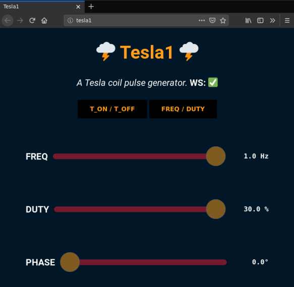

# Tesla 1
A pulse generator using nothing more than a ESP8266 8-pin module (ESP-02). Designed to work as an interrupter for my Tesla coil...


Uses the I2S peripheral to achieve precise timing. Smallest pulse-width is 1 us. Smaller pulse-widths are possible by increasing the I2S clock rate.

Putting an ESP on the control board might be an alternative to the commonly used but quite overpriced fiber-optic transceivers.
It achieves fully isolated control through WIFI.

Will the ESP and its WIFI connection be stable in the tremendous :zap: EMI :zap: of a Tesla coil? We'll find out ...

__... update__: yes, it is stable :ok_hand:. 

I've had it successfully operating in a grounded metal box, directly connected to the [UD2.7 board](http://www.loneoceans.com/labs/ud27/), the box sitting right below the secondary.

Shielding the electronics from the electric field is absolutely mandatory. 
I use a grounded cookie box for the driver board and have some additional copper tape shielding around the esp8266.
This keeps the 300 kHz electric field out while 2.45 GHz WIFI still leaks in surprisingly well, which is what we need here :thumbsup:.

# Features

## Precise frequency generation
Uses an Direct Digital Synthesis (DDS) algorithm to generate a signal with very precise frequency and pulse-width. Theoretical frequency resolution is .2 mHz. The DDS is implemented in software, the esp8266 generates 1 million samples per second. The sample stream is output at a precise sampling rate using the I2S peripheral.

## Web interface



Control your Tesla coil from a smart phone.

Has a minimal but very responsive user interface based on web-sockets. 
There are two control modes: 

  * set `t_ON` / `t_OFF` 
  * set `frequency` / `duty cycle` 

The sliders for timing cover 6 decades on a logarithmic scale. There's a firmware configurable maximum on-time and duty cycle limit, which is always observed.

The web-interface also shows the current WIFI received signal strength indicator (RSSI), which is useful to optimize the antenna and shielding.

## Mains lock
There is support to lock the interrupter to the mains 50 Hz or 60 Hz zero-crossing. By enabling the TC for a quarter or half mains period, the Tesla coil input voltage ramps up more gradually, leading to sword like arc growth.

This requires an opto-coupler or isolation transformer to drive one of the esp8266 GPIO pins with the mains frequency.

## RTP-Midi
Musical Tesla coil support is built right in.

  * up to 3 polyphonic notes, which are xor-ed together to generate the 1 bit output sample
  * setting the midi volume controls duty cycle and hence average power. Polyphonic notes sound better with lower duty cycles
  * full support for midi pitch-bend commands
  * For a good real-time piano keyboard I've used [TouchDAW](https://xmmc.de/touchdaw) on Android
  * To stream Midi songs, I've used [rtpmidid](https://github.com/davidmoreno/rtpmidid) and `aplaymidi` on Debian
  * RTP-midi should also be compatible with many Apple devices

## Output polarity
  * Can be active high or active low, see `platform.ini`
  * There is a ~100 ms turn-on transient when running in `ACTIVE_LOW` mode. Also if the CPU freezes, it will enable the output for several seconds before the watchdog trips. For a more fail-safe operation, don't use `ACTIVE_LOW` mode

# Demo
[Tesla1 60 Hz sync](https://youtu.be/7h7VzaL8ETk)

[Tesla1 dubsteb](https://youtu.be/TvuAkynQ4Mo)

# Building
Needs platform.io installed. Set your WIFI credentials and other parameters in `platform.ini`.

```code
    pio run -t uploadfs -t upload -t monitor
```

# TODO
    * Store midi files on SPIFFS for smoother playback with high ping WIFI connections
    * Add a CW mode with momentary ON push-button
